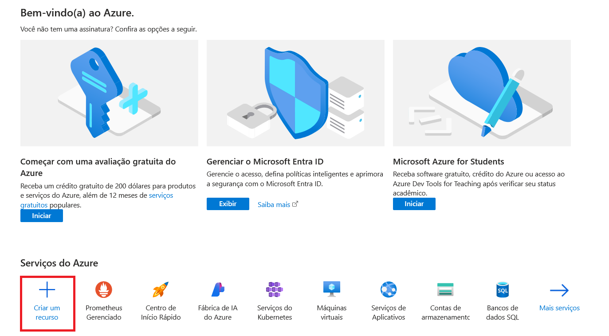
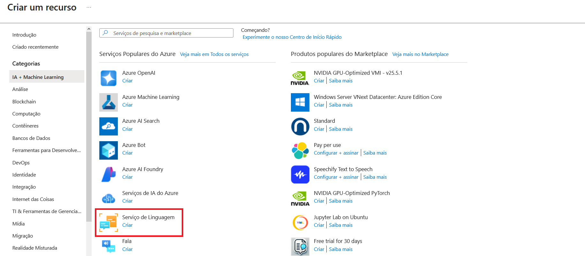
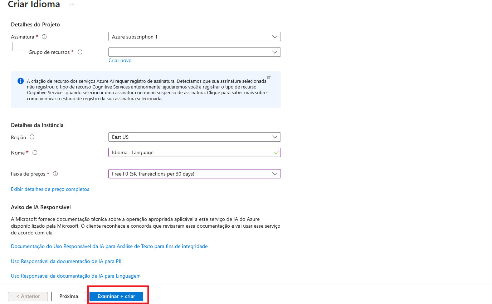
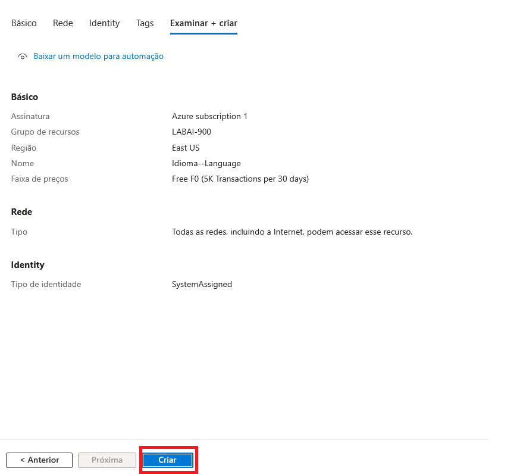
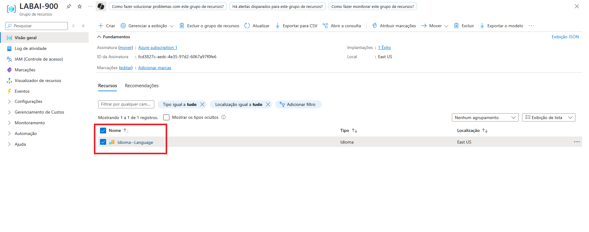
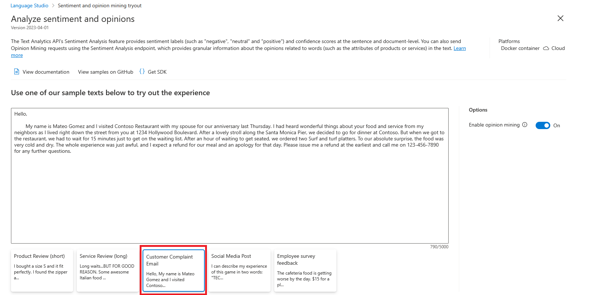
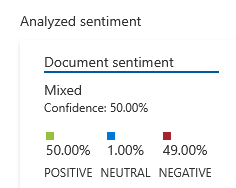
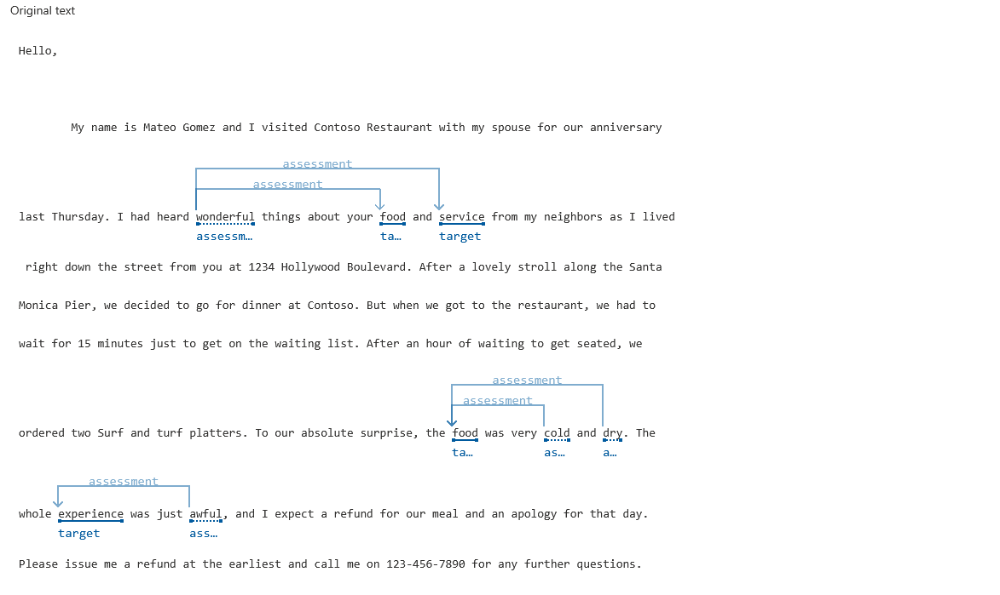

# DIO-Azure-LanguageStudio
Realização do desafio proposto pela DIO para trabalhar os principais pontos relacionados ao Language Studio do Microsoft Azure.

## Passo a passo:
## 1. Criar um recurso

## 2. Selecionar "Serviço de Linguagem"

## 3. Preencher os dados e selecionar (Examinar + criar)

## 4. Selecionar "Criar"

## 5. Selecionar o recurso adicionado ("Idioma--Language")

## 6. Escolher a opção "Classify text" e, então, selecionar "Analyze sentiment and mine opinions"

## 7. Use um dos exemplos para realizar as análises

## 8. Verifique os resultados

## 9. Por fim, verifique as análises realizadas pela plataforma

________________________________________________________________________________________________

## Azure Speech Studio: exemplos

## Conversão de Fala em Texto: 
No Azure Speech Studio é possível transcrever áudios em texto com alta precisão, suportando em dezenas de idiomas. Isso é útil para aplicações como legenda automática e análise de dados de voz. Entre suas principais características estão o reconhecimento automático de fala (ASR - Automatic Speech Recognition) e o suporte à múltiplos idiomas.

## Criação de Vozes Personalizadas:

Ao utilizar o recurso Personal Voice do Azure AI Text to Speech é possível a criação de vozes sintéticas a partir de amostras pré-gravadas pelo usuário. Esse recurso é amplamente utilizado na área dublagem, como também, na acessibilidade para deficientes visuais e personalização de assistentes virtuais.

